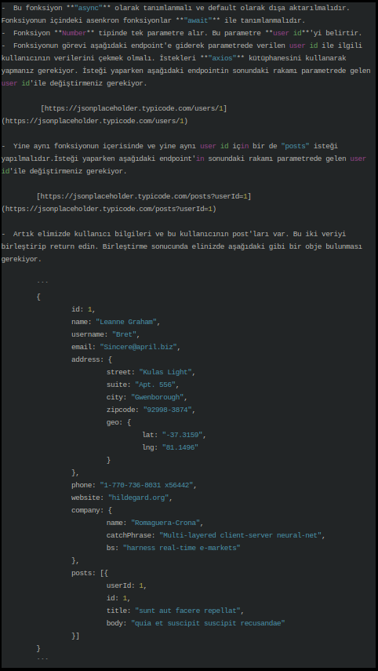
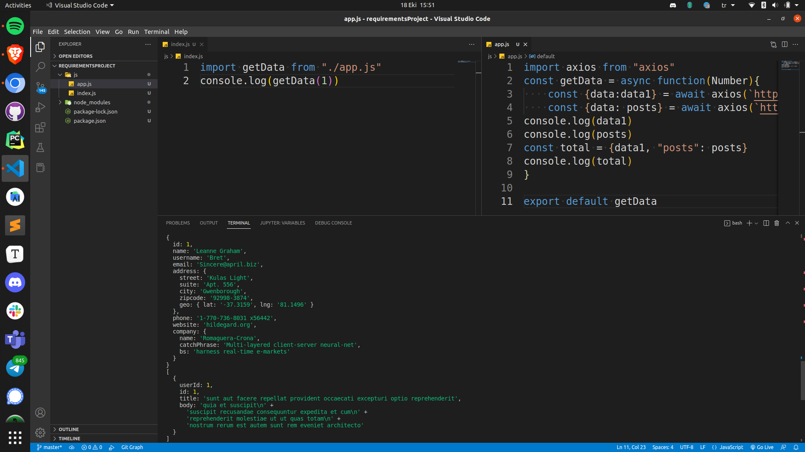

# Requirements Project

 

## About the Project

* The Axios library has supplied the necessary information.

* Acquired algorithmic expertise through efficient use of JavaScript and React.

## Command

To check it, we can type the code into the terminal.

`node js`

## The following is a screenshot of the solution;
 

 
 
 
 
 
 
 
 
 
         
